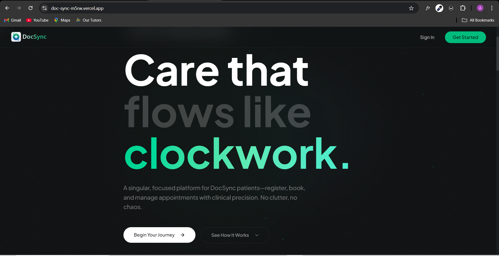
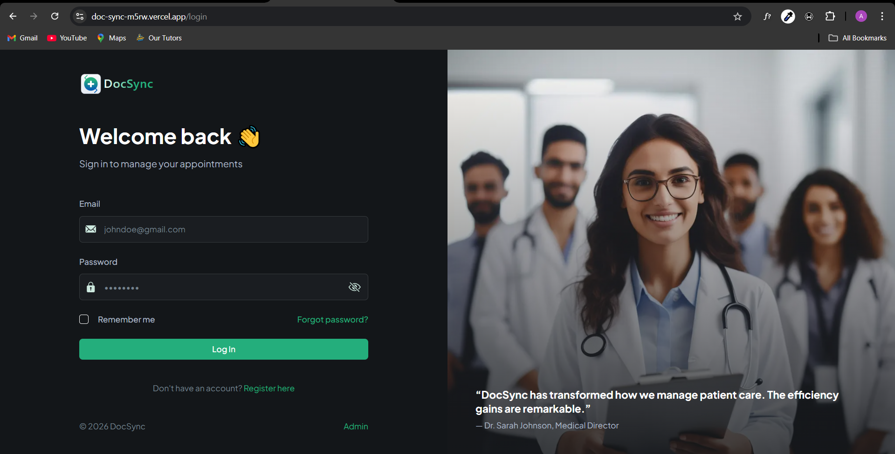
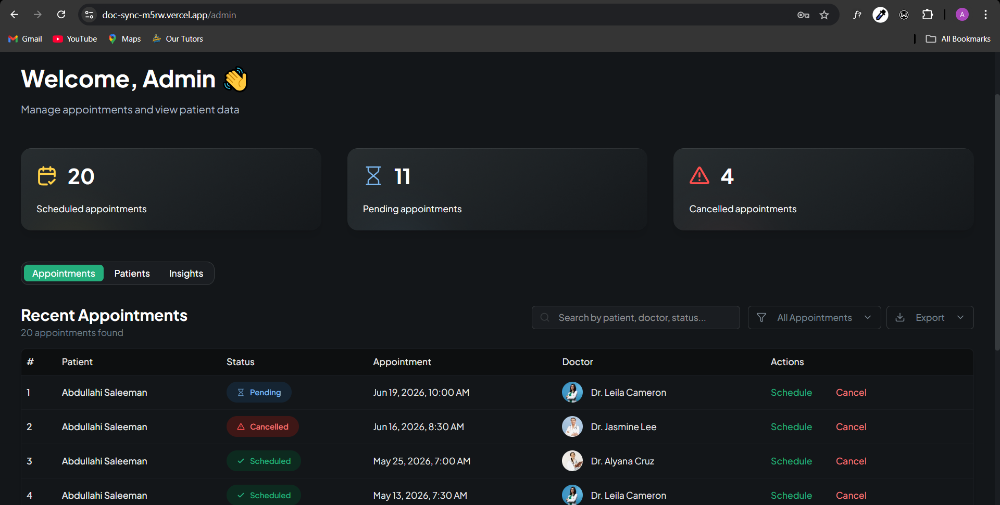
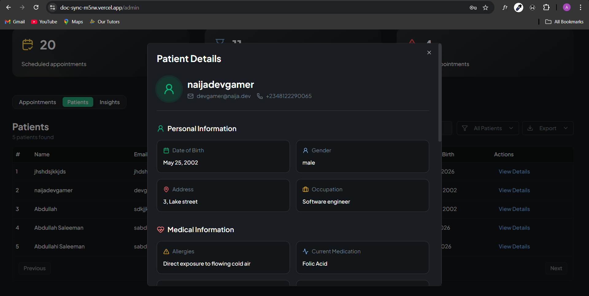
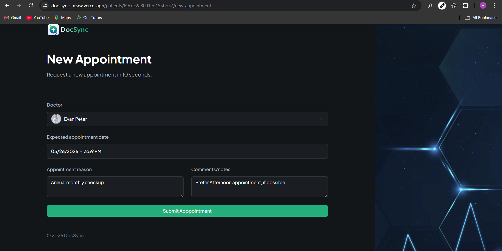
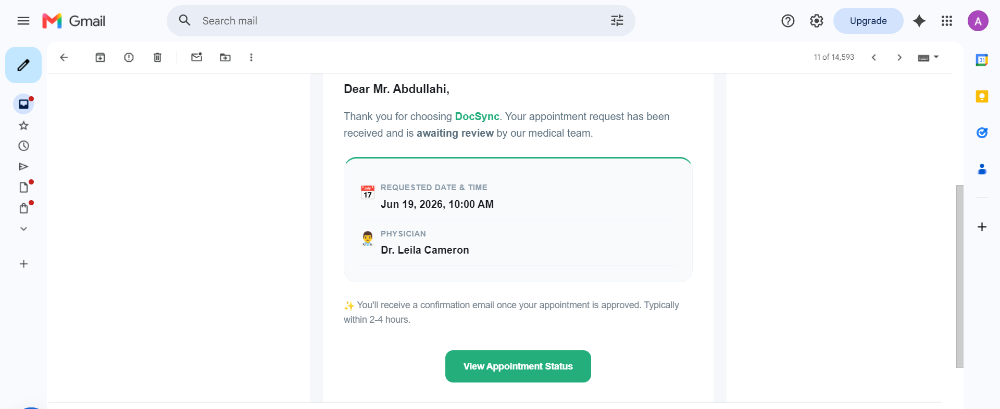

## Problem ⚠️

Small clinics and care teams often juggle patient records, bookings, and admin reporting across multiple tools. This creates friction when staff need to confirm appointments, review patient history, and manage care from one place.

---

## Solution 💡

DocSync brings appointment management, patient profiles, and admin oversight into a single Next.js application backed by Appwrite.

It centralizes authenticated workflows into a responsive dashboard, allowing clinicians to:

- book and manage visits 📅
- track patient records 🧾
- monitor appointment activity 📊

All without switching between disconnected tools.

---

## Features ✨

- 🔐 User authentication and session management with Appwrite
- 📊 Clinic dashboard for admin-level insights and appointment metrics
- 👤 Patient listing with filtering and modal-based record details
- 📅 Appointment creation and scheduling with form validation
- 🔑 Full auth flows: login, registration, password reset, verification
- 🎨 Responsive UI with dark theme and accessible form controls
- 🚨 Error monitoring integration with client-side notifications
- ⚠️ Scalable error handling system, consistent API error responses, and user-friendly UI feedback

---

## Tech Stack 🛠️

- Next.js 16 — server-rendered pages and app routing
- React 19 — component-driven UI
- Appwrite — authentication + backend services
- Resend — transactional email delivery 📧
- shadcn/ui — accessible component system 🎨
- Tailwind CSS + PostCSS — utility-first styling
- React Hook Form + Zod — form handling + validation
- TanStack Table — data tables for patients and appointments
- Framer Motion — smooth UI animations ✨
- Sentry — runtime error tracking
- Sonner — toast notifications

---

## Architecture Overview 🧱

- `src/app` — route layer and layouts
  - `page.tsx` handles user session and landing experience
  - `(auth)` contains login, register, password recovery, and verification flows
  - `admin` contains dashboard and analytics views
  - `patients/[userId]` handles patient appointment and detail pages

- `src/components` — reusable UI and feature modules 🎨
  - `admin` → dashboard panels and tables
  - `forms` → structured form components and validation logic
  - `home` → landing page UI
  - `ui` → base design system components (buttons, inputs, modals)

- `src/lib/appwrite` — authentication and backend integration layer 🔌
- `src/lib/messaging` — email notification service layer 📧
  - Handles appointment-related email triggers:
    - creation confirmation
    - scheduling updates
    - cancellation notifications

- `src/types` — shared TypeScript definitions 🧠
  - Defines global types for:
    - Appwrite user/session models
    - Appointment and patient entities
    - API response structures
  - Ensures type safety across frontend and backend communication

- `src/hooks` — reusable client-side logic (auth, logout, etc.)
- `src/styles` — global styles and theme configuration

The architecture cleanly separates:

- UI (shadcn-based components)
- Business logic (appointments + admin workflows)
- External services (Appwrite + Resend)
- Type safety layer (TypeScript definitions)

---

## System Architecture Diagram 🧱

The system follows a layered architecture separating UI, business logic, and external services.

```txt
                     ┌────────────────────────────┐
                     │        Next.js App         │
                     │  (App Router - UI Layer)   │
                     └────────────┬───────────────┘
                                  │
         ┌────────────────────────┼────────────────────────┐
         │                        │                        │
         ▼                        ▼                        ▼
┌────────────────┐    ┌──────────────────┐    ┌──────────────────┐
│  Auth Layer    │    │  Admin Dashboard │    │  Patient System  │
│ (Appwrite)     │    │  UI + Analytics  │    │  Records & Views │
└───────┬────────┘    └────────┬─────────┘    └────────┬─────────┘
        │                       │                        │
        └──────────────┬────────┴──────────────┬────────┘
                       ▼                       ▼
          ┌──────────────────────┐   ┌──────────────────────┐
          │ Business Logic Layer │   │  Type System Layer   │
          │ - Appointments       │   │  (src/types)         │
          │ - Scheduling         │   │  Shared Contracts    │
          │ - Validation         │   └─────────┬────────────┘
          └──────────┬───────────┘             │
                     ▼                         │
        ┌──────────────────────────┐          │
        │ External Service Layer   │          │
        │ - Appwrite (DB/Auth)     │          │
        │ - Resend (Emails) 📧     │          │
        └──────────┬───────────────┘          │
                   ▼                          │
        ┌──────────────────────────┐          │
        │ User Notification System │◄─────────┘
        │ - Emails (Resend)        │
        │ - Toast UI (Sonner)      │
        │ - Error Feedback Layer   │
        └──────────────────────────┘
```

---

## System Design Overview 🧠

DocSync is designed as a modular, event-driven healthcare management system built on a layered architecture. The goal is to maintain clear separation of concerns between UI rendering, business logic, and external service integration.

### 1. Presentation Layer (Next.js App Router)

The UI layer is responsible for rendering pages and handling user interaction. It is structured using Next.js App Router to support:

- Route-based code splitting
- Server/client component separation
- Scalable feature-based folder structure

UI components are built using **shadcn/ui**, ensuring consistency, accessibility, and reusability across the application.

---

### 2. Business Logic Layer

Core application logic is isolated from UI concerns. This layer handles:

- Appointment creation and lifecycle management
- Admin scheduling and cancellations
- Input validation and workflow rules

By isolating business logic, the system remains testable and scalable as new features are introduced.

---

### 3. Data & Authentication Layer

Authentication and data persistence are handled through Appwrite, which provides:

- Secure user authentication flows
- Session management
- Backend database operations

This abstraction allows the frontend to remain backend-agnostic in terms of implementation details.

---

### 4. Notification System (Event-Driven Behavior)

The system implements an event-driven notification flow using Resend.

Key events trigger transactional emails:

- Appointment creation → confirmation email 📩
- Admin scheduling → update notification 📅
- Appointment cancellation → cancellation alert ❌

This ensures users remain informed of system state changes in real time.

---

### 5. Type Safety Layer

All shared models are defined in `src/types`, ensuring strict consistency across the system.

This prevents:

- API contract mismatches
- runtime data inconsistencies
- silent UI failures

It acts as a safeguard for long-term scalability.

---

### 6. Error Handling Strategy

DocSync implements a centralized error handling approach:

- Standardized error responses from backend actions
- Unified client-side error parsing
- User-friendly feedback via toast notifications
- Optional logging integration for monitoring

This ensures predictable failure handling and improves overall system resilience.

---

### Design Philosophy

The system prioritizes:

- Separation of concerns
- Predictable data flow
- Modular scalability
- Clean integration boundaries between services

This allows the application to scale from a small clinic tool into a multi-tenant healthcare management platform without major architectural changes.

## Screenshots 📸

1. **Home / Landing Page**

   

2. **Login Page**

   

3. **Admin Dashboard 📊**

   

4. **Patient List + Modal 👤**

   

5. **Appointment Form 📅**

   

   

---

## Live Link 🌐

👉 https://doc-sync-m5rw.vercel.app

---

## Setup Instructions ⚙️

1. Clone the repository

```bash
git clone https://github.com/naijadevgamer/DocSync.git
cd DocSync
```

2. Install dependencies

```bash
pnpm install
```

3. Configure environment variables

- Create a `.env` file in the project root
- Add Appwrite endpoint, project ID, and any authentication keys used by the app
- If using Sentry, add the DSN and environment values as needed

4. Run the development server

```bash
pnpm dev
```

5. Build for production

```bash
pnpm build
```

Once the dev server is running, open `http://localhost:3000` in your browser.
`
